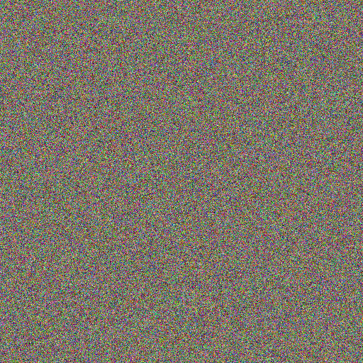
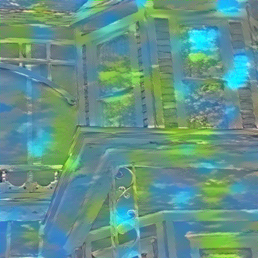

# **Neural Style Transfer (NST) with VGG19**
## Transfer Artistic Style to Any Image Using Deep Learning

This project implements **Neural Style Transfer (NST)**, a deep learning technique that **applies the artistic style of one image (style image) to another (content image)** while preserving the original structure.

The model is based on **VGG19** and uses a combination of **content loss** and **style loss** to optimize the generated image.

---

## **Inputs Preview**
| Initial Content image | Initial Style Image |
|:-----------------------------:|:--------------------------------:|
|       |    |


## **🚀 Results Preview**
| Step 0 (Initial Random Noise) | Step 7000 (Final Stylized Image) |
|:-----------------------------:|:--------------------------------:|
|        |    |

*🔹The left image is the initial random noise. The right image is the final stylized version after 7000 iterations.*

---

## **Project Overview**
### **1️⃣ How NST Works**
NST works by optimizing a target image to minimize two types of losses:
- **Content Loss** – Ensures that the **main structure of the content image** is retained.
- **Style Loss** – Ensures that the **textures and patterns of the style image** are transferred.

### **2️⃣ Our Approach**
✔ **Preprocess images**: Resize and normalize both content and style images.  
✔ **Feature Extraction**: Use **VGG19** convolutional layers to extract feature maps.  
✔ **Optimize Target Image**: Start from **random noise** and optimize it using **content & style losses**.  
✔ **Save Progress**: The output image improves gradually over multiple steps.

---

## **Dependencies**
To run the project, install the required Python libraries:

```bash
pip install torch torchvision numpy tqdm pillow opencv-python
```

---

## **📂 Project Structure**
```
📁 NST_Project
 ├── 📁 images                  # Folder for input images
 │   ├── content.jpg            # Your content image
 │   ├── style.jpg              # Your style image
 │   ├── result_0.png           # First output (random noise)
 │   ├── result_7000.png        # Final stylized image
 ├── 📜 nst.py                   # Main Python script
 ├── 📜 README.md                # This README file
```

---

## **Preparing Your Images**
Before applying NST, we need to **crop** and **resize** the images to the same size:

```python
from PIL import Image
from pathlib import Path

def crop_it(img):
    input_path = Path(img)
    image = Image.open(img)
    width, height = image.size
    left = (width - 512) / 2
    right = left + 512
    top = (height - 512) / 2
    bottom = top + 512
    cropped_img = image.crop((left, top, right, bottom))
    modified_path = input_path.with_name(f"{input_path.stem}_crop{input_path.suffix}")
    cropped_img.save(modified_path)
    return cropped_img.show()

crop_it('path/to/style.jpg')
crop_it('path/to/content.jpg')
```

---

## **Implementing NST**
### **1️⃣ Load Pretrained VGG19 for Feature Extraction**
We load a **pre-trained VGG19 model** but remove the fully connected layers, keeping only the convolutional layers.

```python
import torch
import torchvision.models as models
import torch.nn as nn

device = torch.device('cuda' if torch.cuda.is_available() else 'cpu')

class VGG(nn.Module):
    def __init__(self):
        super(VGG, self).__init__()
        self.select_features = ['0', '5', '10', '19', '28']  # Conv layers
        self.vgg = models.vgg19(pretrained=True).features
    
    def forward(self, output):
        features = []
        for name, layer in self.vgg._modules.items():
            output = layer(output)
            if name in self.select_features:
                features.append(output)
        return features

# Load the model
vgg = VGG().to(device).eval()
```

---

### **2️⃣ Define Loss Functions**
#### **🔹 Content Loss**
```python
def get_content_loss(target_vec, content_vec):
    return torch.mean((target_vec - content_vec) ** 2)
```
#### **🔹 Style Loss (Using Gram Matrix)**
```python
def gram_matrix(input, c, h, w):
    input = input.view(c, h * w)
    return torch.mm(input, input.t())

def get_style_loss(target, style):
    _, c, h, w = target.size()
    G = gram_matrix(target, c, h, w)
    S = gram_matrix(style, c, h, w)
    return torch.mean((G - S) ** 2) / (c * h * w)
```

---

### **3️⃣ Load Images & Preprocess**
```python
from torchvision import transforms
from PIL import Image

loader = transforms.Compose([
    transforms.Resize((512, 512)),
    transforms.ToTensor(),
    transforms.Normalize([0.485, 0.456, 0.406], [0.229, 0.224, 0.225])
])

def load_img(path):
    img = Image.open(path)
    img = loader(img).unsqueeze(0)
    return img.to(device)

content_img = load_img('path/to/content_crop.jpg')
style_img = load_img('path/to/style_crop.jpg')
```

---

### **4️⃣ Initialize the Target Image**
```python
target_img = torch.randn_like(content_img, device=device, requires_grad=True)
```

---

### **5️⃣ Define Optimizer & Training**
```python
import torch.optim as optim
from tqdm import tqdm

optimizer = optim.Adam([target_img], lr=0.01)
alpha = 50  # Content weight
beta = 50   # Style weight

content_feature = [f.detach() for f in vgg(content_img)]
style_feature = [f.detach() for f in vgg(style_img)]

steps = 10000
for step in tqdm(range(steps)):
    target_feature = vgg(target_img)
    content_loss = sum(get_content_loss(t, c) for t, c in zip(target_feature, content_feature))
    style_loss = sum(get_style_loss(t, s) for t, s in zip(target_feature, style_feature))
    
    total_loss = alpha * content_loss + beta * style_loss

    optimizer.zero_grad()
    total_loss.backward()
    optimizer.step()

    if step % 500 == 0:
        save_image(target_img, f'result_{step}.png')
        print(f"Step {step}: Loss = {total_loss.item():.4f}")
```

---

## **References**
- [Original NST Paper (Gatys et al., 2016)](https://arxiv.org/abs/1508.06576)
- [Fast Style Transfer (Johnson et al., 2016)](https://arxiv.org/abs/1603.08155)
- [PyTorch NST Tutorial](https://pytorch.org/tutorials/advanced/neural_style_tutorial.html)

---

